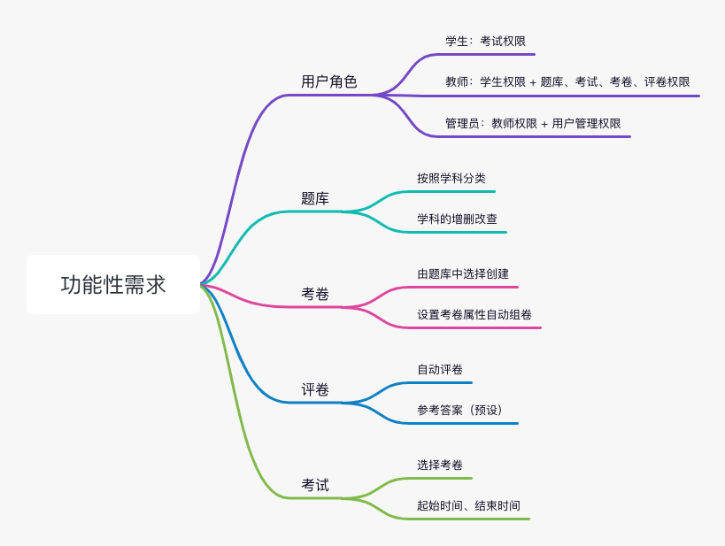
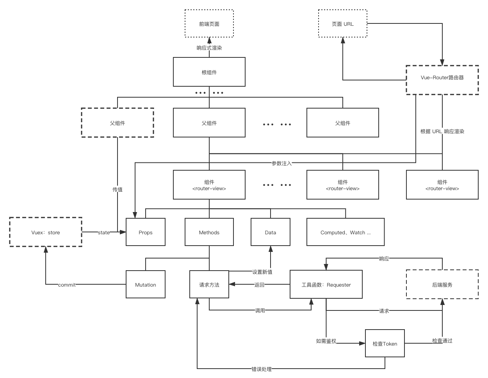
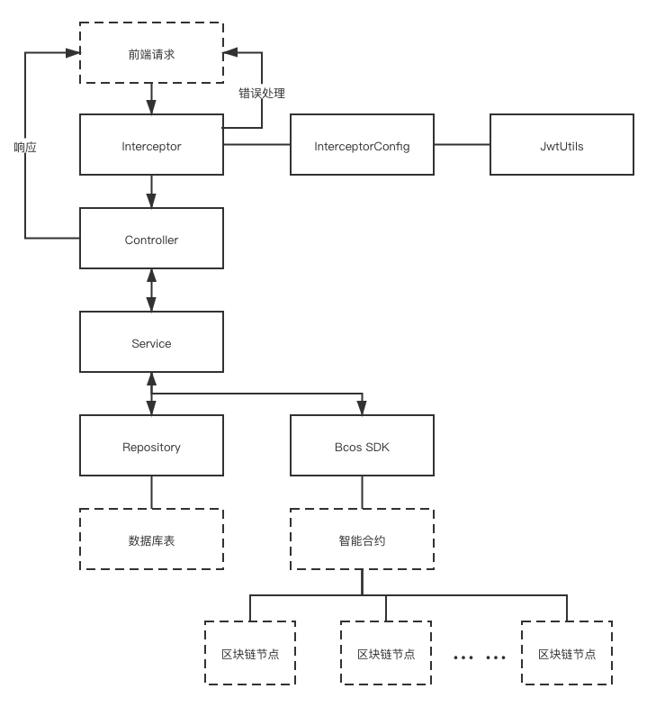
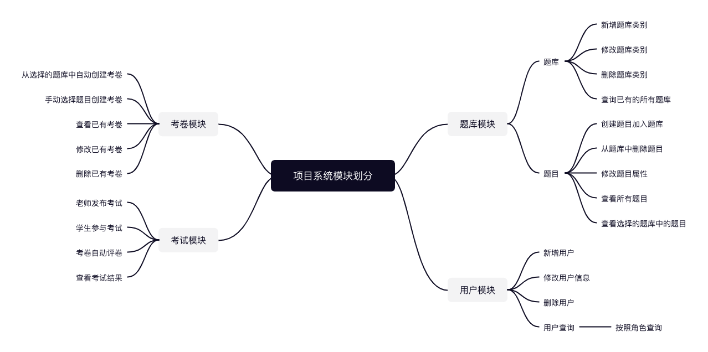
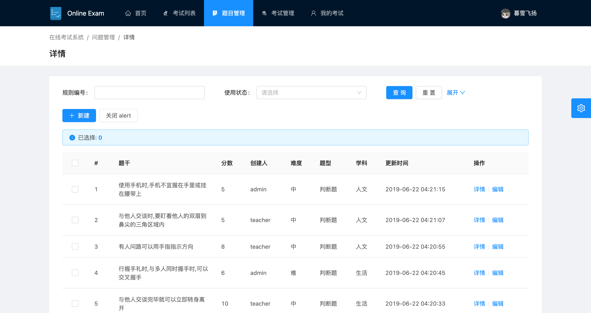
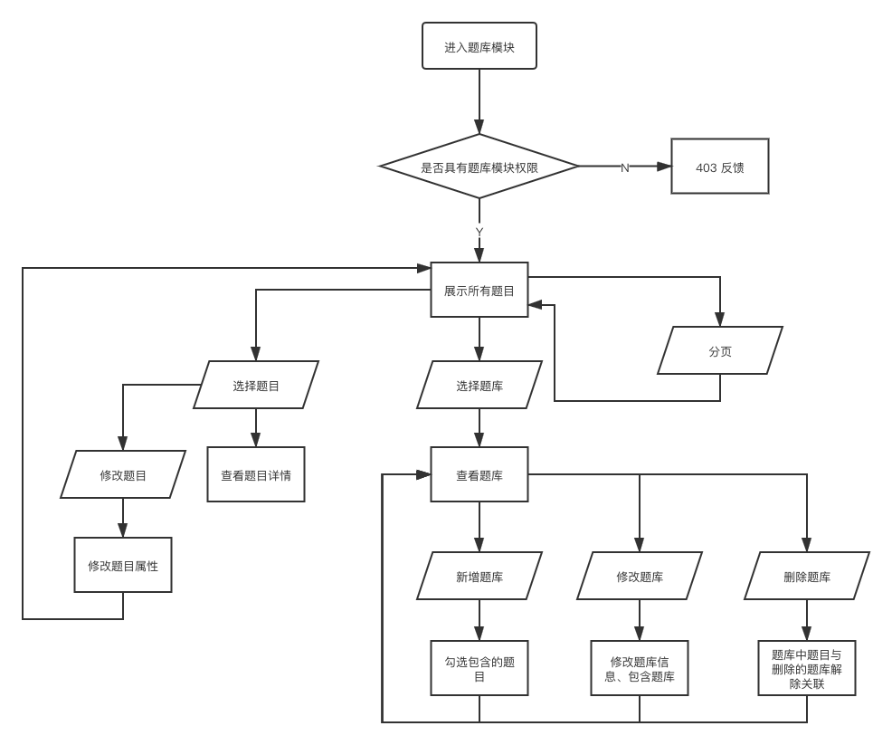

***基于区块链的考试系统的设计与开发***

## 摘要

#### 关键字

区块链；Fisco；在线考试系统；SpringBoot；Vue；

## Abstract

#### Keyword

Block-chain; Fisco; Online Exam-system; SpringBoot; Vue;

## 一、绪论

### 1.1 背景研究

2016年7月，中共中央、国务院办公厅印发了《国家信息化发展战略纲要》，规范和指导了未来10年中央对国家信息化的指导思想和战略方针。信息技术的基础水平和相关产业的发展程度，与国家信息化进程密切相关。《国信纲要》提倡，要加强信息技术领域前沿和基础研究，同时应用相应技术，打造协同发展的产业生态。[^1]2020年5月两会期间，多位人大代表和政协委员提出了，关于区块链技术在产业中的应用、促进产业发展升级和数字货币监督监管问题，三大方面的想法与提议。由此可知，区块链已然成为了当下乃至今后十年内，我国科技、信息领域发展的“顶层设计”。[^2]在这样的发展潮流下，区块链的落地应用和技术推广如雨后春笋：国家邮政局鼓励以区块链为主要应用核心的新一代技术升级；银保监会为提高数据安全性，在交易环节应用区块链技术；[^3]教育部也在《全国大中小学教材建设规划（2019-2022年）》的记者问答中表示，下一步将围绕区块链等新技术领域重点建设，集中力量编写、打造新经典教材。[^4]

2020年初的疫情导致近乎所有学生都参与到了线上教学，由此影响，在线课堂、在线考试受到了极大的推广。腾讯会议、钉钉、腾讯课堂等线上视频会议的产品快速迭代之中逐渐成熟。与之相应，也诞生了许多在线考试的相关解决方案，例如超星学习通、中国大学慕课、智慧树。线上考试的方式与传统的线下纸质化考试相比，有如下的优劣之处：[^5]

1. 能够代替教师的部分工作，一定程度上地方便学校、教育机构对考试的安排管理，提高了工作效率；
2. 有效地缩短考试前期安排的组织周期，减轻了相关通知传递过程中的人力损耗；
3. 线上交卷、评卷缩短了学生得到考试反馈结果的时间周期；
4. 在相关硬件设施条件满足的前提下，进一步地保证了考试过程中的公平公正；
5. 存在线上系统都无法避免的网络攻击风险；
6. 数据集中化存储管理，有潜在的被篡改等安全问题；

如上的在线考试解决方案通常使用了移动端 C/S 结构，桌面端 B/S 结构。如此的客户端-服务端解构模式，实现了在不同的用户前端实现下，用户数据的共通。在这样的项目架构模型中，数据的安全性、可靠性、可信度便显得尤为关键。结合这两个方面，提出本项目「基于区块链技术的线上考试系统」。线上考试系统的方式合理利用了当今时代互联网的便捷性与普及程度。采用国家大力支持推广的区块链技术，可以有效地保证数据存储管理的安全性。

区块链技术最早由中本聪于《比特币:一种点对点的电子现金系统》[^6]一文中提出，是一种类似于分布式的账本的数据存储与管理技术。在共识机制、工作量证明（PoW）等方式保障下，区块链技术具有：不可篡改、可追溯源、去中心化等特性与优点。这些特点正好与线上考试系统的数据安全方面的问题十分契合：防篡改、可溯源保证了考试数据的安全；去中心化的特性发挥了数据分布式存储的优势，降低了集中化数据存储方式存在的安全风险，减轻了系统服务器压力，加强了数据可用性、系统可用性。将区块链技术应用至系统中，会是诸如线上考试系统此类的数据安全敏感系统今后的更新趋势，也呼应了国家对于区块链技术重视与号召。

### 1.2 需求分析

#### 1.2.1 目标用户群体

- 学校、教育机构：有固定时间周期性的测试或考试需要，使用线上考试系统可以覆盖一些简单的定期多次小测验；
- 学生：无纸化的线上考试系统使得考试结果反馈更加快速；

#### 1.2.2 用户主要目的

需要一款线上考试系统的解决方案，能方便快捷的满足学校、教育机构平时周期性的测试的需要。教师能够简单的操作就能配置题目、题库、发布试卷，通过预先设定的参考答案，能够自动评卷登分，将考试结果与相关题目解析快速反馈给参与考试的学生。

#### 1.2.3 功能性需求



##### 用户角色分类

系统的参与者主要分为三类：学生、教师、管理员，学生与教师对应实际业务场景中的角色，管理员是因系统的操作与非业务的操作而存在。

##### 题库功能

题目作为考卷的基本单位，考卷就是多个题目的组成。项目需要题目的基本管理功能。题目按题型又将分为：单选题、多选题、判断题、填空题等。题目按照学科分类，因此又需要题库功能对不同的学科题目进行管理。

##### 考卷功能

考卷是考试进行的必要组成部分，考卷需要由教师手动从题库中选择，或是通过设定一定的规则从设定好的题库中抽取自动组卷。考卷也需要基本的增删改查功能。

##### 考试功能

考试通过选择已创建的考卷而开启，学生可以进入已创建的考试进行线上考试。考试也需要设置起始时间和结束时间属性。

##### 评卷功能

题目设置的时候提供对应的正确答案选项，使得在作答结束后能够通过正确答案与学生的作答情况自动评卷计分，并提供预先设置的参考题解给学生。

##### 用户管理

管理员才被允许对系统中的用户进行新增、删除、修改信息、查看。用户也可以对自己的基本信息做修改，例如修改密码、头像、昵称。

##### 权限分类

根据以上的用户角色分类和功能模块，需要将具体的功能模块访问限制与用户角色对应。学生只允许参与考试和查看自己考试的情况；老师具有学生的所有权限用于考卷的试测，此外需要考卷功能模块、题库功能模块、评卷功能模块的权限；管理员具有所有的功能模块权限，即老师的权限加上用户管理功能模块的权限。

#### 1.2.4 非功能性需求

- 界面美观，布局简洁大方；
- 用户交互操作友好。用户意外的错误操作，或是发生运行时错误，应有合理的信息提示；
- 系统使用需要有清晰、完善的文档说明，项目代码注释完善、易读；
- 项目需要具有足够的测试性，以保证系统性能可用于实际环境；
- 项目结构设计良好、易于维护，并留存有一定后期功能拓展的空间；
- 用户操作具有完备的鉴权流程，防止非法操作；
- 前端布局弹性，根据不同的分辨率响应式渲染展示；

### 1.3 进度安排

- 2021/1/8 - 2021/2/28：确定选题，查阅文献，外文翻译和撰写开题报告。这期间主要通过导师提供的相关材料，以及自己查阅相关的文献，熟悉项目题目的研究背景、应用领域、技术生态。在完成了文献查阅和外文文献翻译后，根据自己的这阶段对项目选题的方方面面的理解，撰写开题报告；
- 2021/3/1 - 2021/3/20：完成系统核心功能设计，主要包括数据库表设计，对项目中实体的抽象；使用 Vue 及其相关技术栈实现最小 Demo，主要目的是通过实际开发实践巩固所学的前端技术部分的理论知识；熟悉 SpringBoot、Fisco Bcos 等后端部分的技术文档，对业务对象、功能模块的设计实现有一定思考和初步设想，能做到胸有成竹；
- 2021/3/21 - 2021/4/20：参考网上成熟的系统界面原型设计，对前端部分的布局和组件抽象有大概的构想；编写项目的核心功能模块的代码，包括前端页面展示部分和后端数据处理部分；
- 2021/4/21 - 2021/5/11：尝试与实践区块链的结点部署，并修改项目后端核心实体对象的数据处理，增加区块链接入层，实现安全敏感的重要数据上链；
- 2021/5/12 - 2021/5/18：熟悉相关的测试技术，对项目进行单元测试、压力测试等各方面的测试，并记录数据；
- 2021/5/19 - 2021/5/31：撰写及修改毕业论文；
- 2021/6/1 - 2021/6/5：准备答辩。

### 1.4 论文结构安排

第一章绪论介绍了在当下的社会政策与技术潮流中，项目的研究和应用意义。以及分析了项目面向的用户群体，用户需求。

第二章简要介绍了项目所使用的相关技术栈，简要概述了技术选型的思考过程：选用的技术的稳定程度与社区生态；与相似技术及其技术栈对比之中的优劣；与项目开发的适用性。

第三章介绍了系统的整体设计模型、分层的构思过程，项目系统具体的分工模块，模块间的相互协作。

第四章重点着眼于项目系统的几个核心模块的代码实现思路，和模块的代码开发中所遇到的难点、个人的思考与解决方式。

第五章展示了使用相关的测试技术对项目应用时各方面的测试结果与结论。

第六章总述个人对于项目仍存在的不足之处，和潜在的改进空间。

## 二、相关技术

### 2.1 Fisco Bcos

区块链按照类型可划分为：公有链、私有链、联盟链。公有链对全网公开，默认公开化，任何人都能成为其中的节点，访问其中的数据。就如同国家高速，任何人都能随意的开车驶入。而私有链的使用和部署范围则与公有链相反，交易、验证操作都被局限于一个企业的规模之内，具有一定的封闭性、良好的隐私性、数据的安全性。由于私有链的规模特点和共识机制特点，交易的手续费（gas）与公有链相比较低，交易速度（或称为出块速度）亦是公有链无法相比的。联盟链则可视为公有链和私有链的结合，同时包括了两者的特点。联盟链在本质上更接近于私有链，其应用范围为更大范围的组织之内，可能由众多机构组成，但到底仍是由十分有限的结点组成，因此联盟链具有的是部分去中心化的特点。此外，联盟链可控性较强。由于节点数的规模缘故，交易速度也介于公有链、私有链之间，但也远快于公有链。如上特点与项目系统对于敏感数据上链的需求十分匹配。联盟链在实际项目中节点成员都存在于同一的受信任组织内，根据实际的项目系统需要修改区块链上规则，部署新的合约等操作也更为方便。故而，系统的后端区块链部分选用联盟链的技术是十分合适的。

现今海外区块链技术的开源设计框架，数 IBM 的 Fabric 较为成熟，也有活跃的社区生态。而自2018年3月始，中美贸易争端不断，更有甚者，对我国多项核心技术施压。因此未雨绸缪，支持国内区块链技术的发展，选用 Fisco Bcos 作为项目的区块链技术框架。Fisco Bcos 是由金融区块链合作联盟（金链盟）开源的一款区块链底层框架，是受工信部认可的三大开源区块链底层平台之一。具有深度定制的安全性、可控性的特点，根据实际需要，实现符合国内需要的独特设计。社区生态丰富，应用领域广泛，截至2020年5月，共有上千家的企业与机构、逾万名社区成员参与共建共治，发展成为最大最活跃的国产开源联盟链生态圈。

### 2.2 SpringBoot

Spring 是目前后端领域生态最为活跃，且发展迅猛的开源框架。Spring 是为了解决企业级应用开发的复杂性而诞生。Spring 为简化 Java 的开发，采用了以下几种关键策略：

- 基于 POJO（Plain Ordinary Java Object）的轻量级，实现最小侵入性编程；
- 通过控制反转（Invert of Control）和依赖注入（Dependency Injection）等特性实现接口编程的低耦合；
- 面向切面编程（AOP）；

然而随着 Spring 的技术生态发展和社区活跃度不断上升，Spring 被应用于越来越多的实际生产项目中，涉及领域愈发广泛。因而，开发一个 Spring 项目需要整合的文件也随之变得复杂、繁琐，与其设计初衷背道而驰。

脱胎于繁琐配置的 Spring，SpringBoot 是由 Pivota 团队提供的全新框架，其设计目的旨在简化 Spring 应用的初始化构建以及开发过程。SpringBoot 的理念是“约定大于配置”，且有如下的特点：

- 开箱即用，从根本上实现更快的入门体验；
- 内嵌 Tomcat、Jetty 或 Undertow，使得开发者无需额外部署 WAR；
- 提供了丰富的封装好的 starter 依赖，用于简化开发过程中的构建配置；
- 自动配置 Spring，且具有良好的扩展性。如有需要，简单配置便可引入第三方库；
- 无代码生成、无需编写XML；

SpringBoot 具有丰富的项目应用范例、良好的社区生态与开发体验，因此选用 SpringBoot 作为项目后端的技术框架，能够通过现有的优秀项目，参考学习其设计、构想；活跃的社区也能在实际的项目开发过程中避雷避坑，给一些疑难问题提供解决思路。

### 2.3 SpringData JPA

历史车轮滚滚向前，最初 Java 后端开发框架技术栈的三驾马车 SSH（Struts、Spring、Hibernate）这一 JavaEE 框架风靡一时。而随着技术更新迭代，其中的 Struts 被 SpringMVC 所替代，再后来随着开箱即用、自动配置的 SpringBoot 的出现逐渐让开发者从 Spring + SpringMVC 的阵营中转投。Hibernate 作为技术栈中的数据持久化 ORM 框架，也出现了许多优秀的横向竞品，例如 MyBatis、JPA。这些 ORM 框架各有优劣，而 MyBatis 更受国内大部分的开发者欢迎。然而，MyBatis 的无论是 XML 写法，亦或是注解的使用方式，mapper 的代码编写总是让人觉得略有心烦。相较之下，SpringData JPA 无需 mapper 的使用方式更为简洁。

SpringData JPA 作为 Spring 官方推荐的数据库访问组件，简化了各种数据库的访问操作。在 SpringData JPA 中数据访问层对象（DAO）的实现，是通过 Repository 作为 DAO 层接口来操作实体类所对应的数据表。Repository 模式是领域驱动设计中另一个经典的模式。当一个接口继承 JpaRepository 接口之后便自动具备了一系列常用的数据操作方法。因此，在抽象出业务流程中的实体（Entity）以后，在其实体类加上`@Entity`的注解，便可以将实体类与 Repository 接口相关联，并提供了基础的增删改查，乃至分页等，实际业务中常见的基础数据库操作。这样的实现极大的省去了后端开发中的一部分基础代码编写，减轻了后端开发过程中的心智负担。

### 2.4 Vue.js

自从实际的项目应用的规模不断膨胀，前端部分与用户交互的业务也随之变得复杂。传统项目中，项目的分层结构是 MVC 的三层模型：Model 层、View 层、Controller 层。但是在前端业务逻辑十分复杂的情况下，View 层显得十分的臃肿，静态模板的语法也显现出落后于时代潮流的笨拙与不优雅。因此，使用前后端分离的项目，将项目的前端部分与后端的数据、业务操作解耦。在这样的发展潮流中，涌现了许多性能优异、理念前卫的前端框架：Angular、React、Vue等。其中，Vue 和 React 都遵从“数据驱动视图”的 MVVM 模型的理念。类似于函数式的思想`View = F(Data)`数据的更新驱动着视图的重新渲染。而其中又将业务逻辑代码、页面展示代码抽象做组件（Component），发挥了组件复用的优势。

随着 Angular 的式微，React 和 Vue 逐渐得到了更多的前端开发者的欢心。React 使用 JSX 的类 XML 的新模板语法展现出了灵活的代码编写能力，随着以函数式编程（Functional Programming）为核心的 React Hooks 的推出，React 的发展迅猛。而为兼容传统的 HTML+CSS+JS 前端开发的心智模型，Vue 的语法更为直接，允许开发者采用简洁的模板语法，来声明式地将数据渲染进 DOM 系统。正如其宣传所言“Vue 是一套用于构建用户界面的渐进式框架”，响应式的编程更是让开发者摆脱了 React 中繁杂的生命周期（Lifecycle）函数的心智负担，也展现出了稍优于 React 的性能。

与 React Hooks 近乎相同的时期，Vue 也推出了 3.0 版本，较为大的改动也是引入了类似 Hooks 的函数式编程的「组合式 API」。但鉴于 Vue 3.0 是2020年9月才正式发布，相关的社区生态，技术问题解答仍处于一个较为初期的阶段。因而，选用 Vue 2.x 的版本进行项目的前端开发，更为稳妥。

### 2.5 Ant Design Vue

Vue.js 已经提供了十分优秀的前端代码开发的方式，但是除开 Vue 解决的响应式渲染、数据驱动、组件复用等问题以外，仍有许多值得改进的空间。就如同 SpringData JPA 可以取代简单的数据库增删改查操作一样，前端的组件库也解决了相似的问题：将统一设计语言的样式、基础的代码以及丰富的 API 接口封装成可重用的组件。从而，省去了一部分的基础代码编写。

现如今社区中存有许多针对 Vue 开发的组件库：Element-UI、Ant Design Vue、Vuetify。Element-UI 由饿了么前端团队开源，而 Ant Design Vue 是蚂蚁金服维护的开源组件库。二者在使用和性能方面相差无几，但 Ant Design Vue，作为React 社区内最为流行的组件库之一 —— Ant Design，的延伸开源库，和其具有一样的优秀特性：企业级的交互设计语言和视觉展示风格、开箱即用的高质量组件。最为关键的一点是 Ant Design Vue 和 Ant-D 一样具有优秀且详尽的文档，各式组件 API 都配有简单的 Demo 样例。较为复杂的业务场景问题，也整理成 Q&A 文档。在个人先前的开发使用体验中也有明显的体会到，Element 的文档丰富程度还是逊于 Ant Design Vue 的。因而，选用 Ant Design Vue 作为前端开发过程中的组件库。

### 2.6 IDEA & Webstorm

IDEA 和 Webstorm 同属 IntellJ 公司推出的功能强大、性能优异的集成开发环境（IDE）。具有丰富的预置功能，例如语法检查、代码补全、源码索引、根据上下文的智能相关操作建议，和 Git/SVN 版本控制等强大功能。IDEA 主要面向的是 Java 相关技术栈的开发人员，因而预先集成了 Maven 与 Spring Initializr 等工具，节省了项目开展过程中一些开发时环境配置的步骤。Webstorm 与 IDEA 相似，但主要面向于前端开发人员。由于项目采用了前后端分离的结构，因此前端部分的开发使用 Webstorm，后端部分的开发则由 IDEA 完成，以有良好、便捷的开发体验。

## 三、系统设计

### 3.1 总体架构模型设计

#### 3.1.1 前端架构模型



Vue 的技术基础是将根节点组件挂载在页面的一个 DOM 元素上，而根节点组件由可由多个组件组成，如此向下细分成子组件。组件系统是 Vue 的另一个重要概念，因为它是一种抽象，允许我们使用小型、独立和通常可复用的组件构建大型应用。

组件的数据来源可以划分为：Props、Data、Computed。父子组件之间的数据通信通过 Props，而 Vue 的设计理念中，数据是自上而下单向流动。

面对需要多组件之间共享公共的数据的场景，需要引入 Vuex 的 store。store 将托管的公有数据 state，通过预先在根节点的注册，注入到需要的组件的 Props 中。如有需要对 store 中的数据进行修改，可以将 store 的 mutation 注入到组件的 Methods 中，通过提交（commit）mutation 实现对 store 中的 state 修改。

组件的 Data 也可能来自于用户的交互产生，又或是向后端服务请求的数据。组件中的请求方法，通过调用工具函数 Requester 向后端服务发起请求，其中如有必要应进行 Token 用户令牌的检查。响应得到的数据将返回给请求方法，进而给组件的 Data 赋予新值。

组件的渲染可能受控于父组件的逻辑，也可能受路由器的控制。在父组件中注册成为\<router-view>的子组件，就通过 Vue-Router 的路由器，根据页面的 URL 动态响应渲染。其中也可以通过页面的 URL 动态路由匹配，向组件的 Props 注入匹配到的参数。

#### 3.1.2 后端架构模型



前端请求进入后端服务首先会被拦截器 Interceptor 所截获。通过 InterceptorConfig 配置需要拦截的 api 的 url 规则，并加入对应的 Interceptor。项目中的 JWT 鉴权流程便放在拦截器这一层运行。

请求根据具体 api 的 URL，进入不同的 controller，controller 根据业务调用对应的 Service 中的方法。由于使用了 SpringData JPA，数据库中的表与 Repository 对应且关联，因而 Service 中对 DAO 的操作则需要依赖于 Repository。

针对敏感数据需要上链的 Service，通过 Fisco Bcos 提供的 SDK，接入预先编译成 Java 文件的智能合约。而智能合约由通过密钥对的形式连接至区块链节点组成的网络。

### 3.2 模块划分



项目系统根据功能划分成几个功能模块：题库模块、用户模块、考卷模块、考试模块。

按照权限分类用户角色，其对应的功能模块为：

- 学生：考试模块
- 老师：题库模块、考试模块、考卷模块
- 管理员：题库模块、考试模块、考卷模块、用户模块

### 3.3 Http 请求响应

#### 3.3.1 前端请求

*front/Requester.js/post函数*

```js
function post(url, params = {}, needToken = true) {
    const {token} = TokenManager.getToken()
    ... ...
    Logger.log('⬆️', {url, params})
    return axios({
        method: 'post',
        url: url,
        responseType: 'json',
        data: params,
        headers
    }).then(response => {
        const {data, status, statusText} = response
        Logger.log('⬇️', data)
        return data
    }).catch(reason => {
        const {status, statusText} = reason.response
        Logger.error('⬇️', status, statusText, reason.response)
        throw reason.response
    })
}
```

前端的请求发起主要依赖于基于 xhr 实现的第三方库 axios。axios 由于请求的异步延时特性，所以使用了 Promise 进行了封装。

前端对后端的请求过程中，请求的 url 前缀部分都是相同的。此外，对于常用的 POST、GET 方法，请求头部分也有相似的部分，例如，POST 请求统一使用“application/json”的 content-type，并将具体的请求数据 json 序列化后，通过 axios 的 data 字段写入请求体中。因而，可以对 axios 再做一层定制，封装成项目的工具函数集合 Requester 中 post、get。

在业务流程中，使用 Requester，仅仅需要根据请求的方法，调用对应的 post、get，传入对应的 api 的 url、请求参数 params，和是否需要 token 验证的标志位 needToken。而无需关心其中具体的请求配置，以及响应的错误处理。获取响应以后再通过一层 Promise 解构其中真正需要的响应数据，使得在业务层面对于请求-响应中的细节是透明无感知的，从实际意义上的减轻了业务开发过程中的心智负担。并可以在工具函数 Requester 中加入日志输出，以便在线上部署后，通过日志迅速定位错误信息。

#### 3.3.2 后端响应

*back/ResultVO.java*

```java
@Data
@JsonInclude(JsonInclude.Include.NON_NULL) 
public class ResultVO<T> {

    public ResultVO(Integer code, String msg, T data) {
        this.code = code;
        this.msg = msg;
        this.data = data;
    }

    public ResultVO() {}

    private Integer code;

    private String msg = "";

    private T data;
}
```

*back/ExamController.java/getExamRecordList函数*

```java
@GetMapping("/record/list")
@ApiOperation("获取当前用户的考试记录")
ResultVO<List<ExamRecordVo>> getExamRecordList(HttpServletRequest request) {
    ResultVO<List<ExamRecordVo>> resultVO;
    try {
        // 拦截器里设置上的用户id
        String userId = (String) request.getAttribute("user_id");
        // 下面根据用户账号拿到他(她所有的考试信息)，注意要用VO封装下
        List<ExamRecordVo> examRecordVoList = examService.getExamRecordList(userId);
        resultVO = new ResultVO<>(0, "获取考试记录成功", examRecordVoList);
    } catch (Exception e) {
        e.printStackTrace();
        resultVO = new ResultVO<>(-1, "获取考试记录失败", null);
    }
    return resultVO;
}
```

后端的响应部分更多的是借助 SpringBoot 中 starter-web 启动器所提供的相关框架能力。针对响应体的自定义封装，主要是使用了 ResultVO 这一值对象（Value Object）。其中定义了针对业务而言的状态码 code，即业务操作成功为 0，业务操作失败则为非 0。随之附带 msg 作为扩展的信息说明字段。并且 ResultVO 通过泛型 \<T> 注入具体响应时的数据类型。例如，getExamRecordList 函数中展示的，针对当前业务操作需要的是 List\<ExamRecordVo> 的数据类型，因而，在 try-catch 前初始化的响应结果 resultVO 就是 ResultVO\<List\<ExamRecordVo>>。

### 3.4 数据持久层设计

#### 3.4.1 数据存储

#### 3.4.2 数据上链

### 3.5 鉴权设计

针对前后端分离的项目结构，鉴权设计主要是借助 JWT（JavaScript Web Token）这一通用的解决方案完成。

#### 3.5.1 前端鉴权
*front/TokenManager.js*

```js
// 设置 Token
function setToken({token, userInfo}, remember = false) {
    if (remember) {
        // 写入 localStorage
        localStorage.setItem(...)
    }
    // 在 store 中设置值
    store.commit(...)
	... ...
}

// 获取 Token
function getToken() {
    let token, userInfo
    if (store.getters.getToken) {
        token = store.getters.getToken
    }
    if (store.state.auth.userInfo) {
        userInfo = store.state.auth.userInfo
    }
    if (!token && localStorage.getItem(tokenKey)) {
        token = localStorage.getItem(tokenKey)
        userInfo = JSON.parse(localStorage.getItem(userInfoKey))
        // 在 store 中设置值
        store.commit(...)
        ... ...
    }
    return {
        token, userInfo
    }
}

// 移除 Token
function removeToken() {
    ... ...
}
```

前端部分对于 Token，以及可以与 Token 视作相关联的敏感用户信息 UserInfo，都使用相同的存储管理思路。

针对登录时勾选了“记住登录状态”的情况，将 Token 以及 UserInfo 写入浏览器提供的 localStorage 中。localStorage 是浏览器提供的一种缓存能力，写入 localStorage 中的键值对，可以持久化存储，使得在浏览器退出后也不会丢失。

针对普通的登录情况，则将这些重要数据写入 Vuex 提供的 store 中，方便各组件获取和修改。

如果重新打开浏览器进入页面，且有勾选“记住登录状态”的情况，store 中已有的 Token 是因为进程退出而丢失的，然而 localStorage 中可能还存有未过期的 Token。因而，在 TokenManager 的 getToken 函数中，需要首先检查 store 中是否有保存 Token，如果没有则再在 localStorage 中读取。如果 localStorage 中读取成功，则说明用户是有勾选了“记住登录状态”，则需要将 Token 作为函数返回值之前，将读取到的 Token 存储到 store 中。

Token 存储的情况有多种，但是移除的时候无需关心是否存在，只需要一并清空 store 和 localStorage 中可能存在的键值对即可。

*front/Requester.js/post函数*

```js
function post(url, params = {}, needToken = true) {
    const {token} = TokenManager.getToken()
    if (needToken && !token) {
        Logger.error('not found token')
        return Promise.reject({
            code: 1401,  // 浏览器的401
            msg: 'not found token'
        })
    }
    const headers = {}
    if (needToken) {
        headers['Access-Token'] = `bearer ${token}`
    }
    ... ...
}
```

在 Requester 工具函数中，请求如果设置了 needToken 的标志位，则使用 TokenManager 的 getToken 函数中读取可能存在的 Token。如此设计，在请求的代码编写中，将两个模块解耦，仅仅通过函数调用相互关联，符合“高内聚，低耦合”的设计原则。

如果需要 Token 而 getToken 无法返回有效 Token 时，则需要进行错误的处理。遵照 axios 的 Promise 风格 api，错误处理也使用相似的 Promise.reject。其中自定义状态码设置为“1401”，意图借 HTTP 状态码的 401 相同的含义，再前加上 1，以示区别。

getToken 成功返回 Token 后，则通过请求头中的 Access-Token 字段，在请求中携带上 Token。

*front/Requester.js/handleRequestError函数*

```js
function handleRequestError(error) {
    if (
        (
            error && typeof (error) === 'object' &&
            error.code > 1400 && error.code < 1500
        ) || error.status === 401
    ) {
        TokenManager.removeToken()
    }
    Logger.error(error)
}
```

对于如上的需要 Token，而又没有 Token 的特殊处理情况，则通过 handleRequestError 对于前面定义的特殊状态码“1401”做处理动作，在当前的项目中，仅仅只是调用了 removeToken。但是，将这个针对 Token 的错误处理环节的独立抽离，也是意图方便以后可能会加入的新的错误处理逻辑，使得项目代码留存有一定的扩展空间。

#### 3.5.2 后端鉴权

back/LoginInterceptor.java/preHandle函数

```java
@Override
public boolean preHandle(... ...) throws Exception {
    ... ...
    // 注意要和前端适配Access-Token属性，前端会在登陆后的每个接口请求头加Access-Token属性
    String token = request.getHeader("Access-Token");
    ... ...
    if (token != null) {
        // 请求中是携带参数的
        Claims claims = JwtUtils.checkJWT(token);
        if (claims == null) {
            // 返回null说明用户篡改了token，导致校验失败
            sendJsonMessage(response, JsonData.buildError("token无效，请重新登录"));
            return false;
        }
        ... ...
        return true;
    }
    ... ...
    return false;
}
```

后端的鉴权与前端部分相对应，而后端的请求鉴权主要是通过 SpringBoot 提供的拦截器 Interceptor 框架能力完成。拦截器通过配置对应的拦截规则，调用对应的拦截器，可以实现需要鉴权的请求在进入实际的业务代码 Controller 层之前，在拦截器中进行鉴权。将其这部分鉴权逻辑单独通过拦截器实现，目的是为了同业务代码独立开，互相不影响。如此的设计，也是遵从了“低耦合”的原则思想。

```java
public class JwtUtils {
    // 构建 token 的主题
    private static final String SUBJECT = ... ...;
    // 过期时间为1天
    private static final long EXPIRE = 1000 * 60 * 60 * 24;

    private static final String APP_SECRET = ... ...;

    public static String genJsonWebToken(User user) {
        ... ...
        return Jwts.builder().setSubject(SUBJECT)
                // 下面3行设置 token 中间字段，携带用户的信息
                ... ...
                // 设置过期时间
                ... ...
                // 生成的结果字符串太长，这里压缩下
                .compact();
    }

    /* 校验 token */
    public static Claims checkJWT(String token) {
        ... ...
    }
}
```

将 jsonwebtoken 提供的 api 能力针对项目的业务情况再进行一次封装，成为 JwtUtils 工具。对外仅提供了对 Token 的创建、校验能力。

### 3.6 数据库结构设计

#### 3.6.1 数据库概念设计


#### 3.6.2 数据库逻辑设计

#### 3.6.3 数据库物理设计

## 四、系统实现

~~时序图、流程图~~

### 4.1 题库模块



进入题库模块前需要先检查是否有进入的权限，如果没有则需要一定的 403 反馈。正常操作流程下，没有权限是无法通过点击事件进入题库，但也可能通过浏览器的地址栏 URL，通过路由器强行渲染出对应的题库 View 组件，因此仍是需要在进入模块前进行权限检查。

如果有权限进入，则展示所有的题目，并可以进行分页操作、选择题库查看、选择具体题目操作。

分页操作，则需要在组件中托管具体的 current、pageSize、total 数据，并注入 ant-d-v 提供的 \<Pagination>。分页请求时，向后端发起 /exam/question/list 的 GET 请求，并将 current 和 pageSize 作为参数。在后端 Controller 中接收请求，做处理。

```java
@GetMapping("/question/list")
@ApiOperation("获取问题的列表")
ResultVO<QuestionPageVo> getQuestionList(@RequestParam("pageNo") Integer pageNo, @RequestParam("pageSize") Integer pageSize) {
    ResultVO<QuestionPageVo> resultVO;
    try {
        QuestionPageVo questionPageVo = examService.getQuestionList(pageNo, pageSize);
        resultVO = new ResultVO<>(0, "获取问题列表成功", questionPageVo);
    } catch (Exception e) {
        e.printStackTrace();
        resultVO = new ResultVO<>(-1, "获取问题列表失败", null);
    }
    return resultVO;
}
```

选择具体题库，则展示具体题库下的题目。也可以进行修改题库信息、删除题库或新增题库。

修改题库信息，可以修改题库的名称，或新增、删除其中包含的题目。

删除题库的操作，会将所有当前题库下的题目，与之解除关联。在具体的题库-题目 mapper 表中删除对应的映射。

新增题库的操作则会要求填写题库的基本信息，而后可以选择需要添加入题库的题目。也可以在创建成功以后，再通过修改题库的功能，对题库的题目做管理。

对于具体题目的操作，可以查看题目的详情，也可以对题目配置的属性做修改调整。

```java
@PostMapping("/question/update")
@ApiOperation("更新问题")
ResultVO<String> questionUpdate(@RequestBody QuestionVo questionVo) {
    // 完成问题的更新
    System.out.println(questionVo);
    try {
        examService.updateQuestion(questionVo);
        return new ResultVO<>(0, "更新问题成功", null);
    } catch (Exception e) {
        e.printStackTrace();
        return new ResultVO<>(-1, "更新问题失败", null);
    }
}
```



### 4.2 考卷模块

### 4.3 考试模块

### 4.4 用户管理模块

## 五、系统测试

## 六、总结与展望

### 6.1 总结

### 6.2 展望

## 致谢

## 参考文献
[^1]: [中办、国办印发《国家信息化发展战略纲要》](http://news.ifeng.com/a/20160727/49673717_0.shtml)

[^2]: [两会期间关于区块链的提案汇总](https://zhuanlan.zhihu.com/p/144446850)

[^3]:[国内区块链政策：港台重监管 中央部委推进区块链应用](http://www.ymcall.com/artinfo/981892070622405583.html)

[^4]:[全面落实教材建设国家事权 系统描绘大中小学教材建设蓝图](http://www.moe.gov.cn/jyb_xwfb/s271/202001/t20200107_414566.html)

[^5]:一种基于区块链平台的会计无纸化考试系统

[^6]:[Bitcoin: A Peer-to-Peer Electronic Cash System](https://bitcoin.org/bitcoin.pdf)

